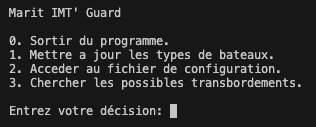

<div align="center">

</div>

<div align="center">


</div>

## About

This repository is an educational purpose software, in collaboration with [Cerema](https://www.cerema.fr/fr) and the French Engineering School [IMT Atlantique](https://www.imt-atlantique.fr/fr). 

_MaritIMT'Guard_, rebranded on 2024 to look good on my portfolio, is a **maritime surveillance software** developed for identifying illegal fishing transhipments. 

This software was an Engineering School Project, developped for [Cerema](https://www.cerema.fr/fr), a public institution dedicated to supporting public policies. 

## How to Use

`Python3` is required. 

1. Clone this repo
2. Install requirements using: 
    ```bash
    python3 -m pip install -r requirements.txt
    ```
3. Set the configuration parameters on the `config.json` file: 
    ```json
    "GENERAL": [
        {
            "INPUT_PATH": "./inputs/ais_log/",
            "OUTPUT_PATH": "./outputs/",
            "OUTPUT_FILENAME": "",
            "DATABASE": "./inputs/ship_databases/ship_db_nano.xlsx",
            "TEXT_EDITOR": "C:/Program Files/Notepad++/notepad++.exe"
        }
    ]
    ```
4. Run the software and interact with the basic `cli`: 
    ```bash
    python3 main.py
    ```
    
    
    0. _Sortir du programme_ finishes the software
    1. _Mettre a jour les types de bateaux_ updates the `TYPE_BATEAUX` section from  `config.json` using the path from `GENERAL["DATABASE"]`. 
    2. _Acceder au fichier de configuration_ prints the `config.json` file and opens your favorite text editor (set in `GENERAL["TEXT_EDITOR"]`). 
    3. _Chercher les possibles transbordements_ runs the main logic of the software and finds illegal transhipments from all the files (set in `GENERAL["INPUT_PATH"]`). 

## Appreciations

We would like to thank [aayaffe](https://github.com/aayaffe) and [pirpyn](https://github.com/pirpyn) for its work on [pyAISm](https://github.com/pirpyn/pyAISm), a small python decoder for AIS messages. 

We would like to thank the Cerema institution for having trust on us and for all the support. 

Last but not least, we would like to thank the professor of the IMT Atlantique for all their support and for allowing this kind of cool high shool projects. 